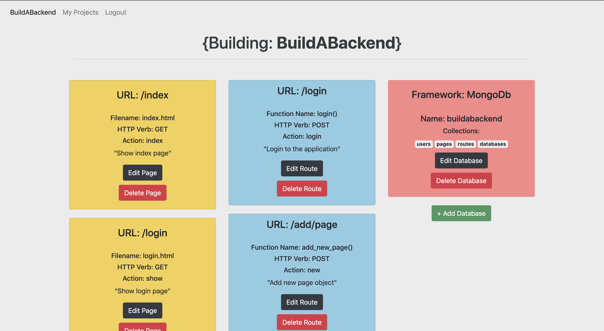

<div style="padding-top: 40px" align="center">
    <h2>Welcome to BuildABackend!</h2>
</div>

<p align="center">
  </a>
</p>
 
<p align="center">
This is a web platform to help YOU design backend architecture for your project. We are currently only supporting the Flask/Jinja and MongoDb frameworks, but more will come at a later time! Add HTML pages with their corresponding routes and request types, databases and dependencies! Once you are done, you can click the Download link to get a project folder with all of the specified files and as much pre-written code as we could manage. 
</p>

<h4 align="center">Happy Building</h4>

<div align="center">
    
</div>

<br>

## Table of Contents
- [Installation](#installation)
  - [Manual](#manual)
-   [Examples](#examples)
-   [License](#license)
-   [Contributors](#contributors)

<a name="installation"></a>

## 🚀 Installation

### Manual

```bash
# Clone repo
git clone https://github.com/APNovichkov/BuildABackend.git
# CD into repo folder and setup python virtual environment
cd BuildABackend 
python -m venv
# Install python requirements
pip install -r requiremenets.txt
# Run in Terminal :)
python app.py
#or
flask run
```

## 📝 License

By contributing, you agree that your contributions will be licensed under its MIT License.

In short, when you submit code changes, your submissions are understood to be under the same [MIT License](http://choosealicense.com/licenses/mit/) that covers the project. Feel free to contact the maintainers if that's a concern.

<a name="contributors"></a>

## Contributors

Contributions are welcome!

<table>
  <tr>
    <td align="center"><a href="https://github.com/APNovichkov"><br /><sub><b>Andrey Novichkov</b></sub></a><br /><a href="https://github.com/APNovichkov/ParticleIO/commits/master" title="Code">💻</a></td>
    
  </tr>
